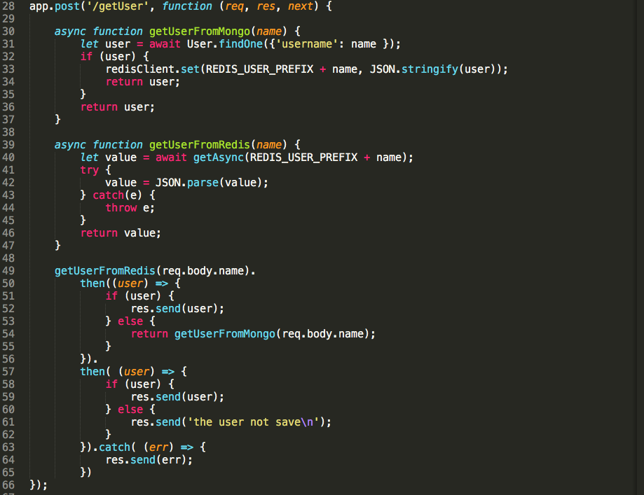
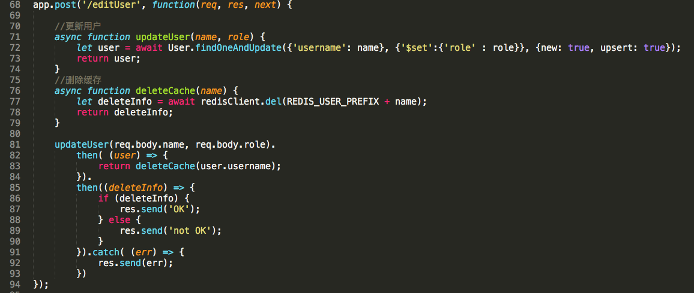

测试编辑
1. 更新数据库
2. 删除缓存


```
curl -X POST http://localhost:3000/editUser  -H 'Content-Type: application/json'  -d '{"name":"liyao", "role": "girl"}'
```


借鉴	陈皓的 [更新缓存套路](https://coolshell.cn/articles/17416.html)，这里使用的是`Cache Aside `，具体逻辑是如下：

* 失效：应用程序先从cache取数据，没有得到，则从数据库中取数据，成功后，放到缓存中。
* 命中：应用程序从cache中取数据，取到后返回。
* 更新：先把数据存到数据库中，成功后，再让缓存失效。


#### 读取数据

;

通过curl测试:
```
curl -X POST http://localhost:3000/getUser  -H 'Content-Type: application/json'  -d '{"name":"liyao"}'
```

1、读取redis缓存，存在，返回；不存在，读取mongodb数据库;
2、数据mongodb，存在返回，并且通过保存到redis中；
3、最后不存在直接返回为空。

#### 更新数据

;

```
curl -X POST http://localhost:3000/editUser  -H 'Content-Type: application/json'  -d '{"name":"liyao", "role": "girl"}'
```


1、更新mongodb数据库；
2、删除redis缓存；
